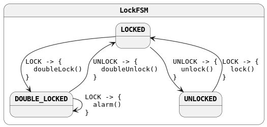

= KFSM samples

image::https://i.creativecommons.org/l/by-sa/4.0/88x31.png[link=http://creativecommons.org/licenses/by-sa/4.0/]
This work is licensed under a link:http://creativecommons.org/licenses/by-sa/4.0/[Creative Commons Attribution-ShareAlike 4.0 International License].

This project contains samples for using link:https://github.com/open-jumpco/kfsm[KFSM]

== Build

[source,bash]
----
git clone https://github.com/open-jumpco/kfsm-samples.git
./gradlew assemble
----

=== Build Graal Native Image

This was tested by building normal build with JDK 8 and 11 and then using Graal 19.1.1 to build the native image.

[source,bash]
----
# Install GraalVM native-image compiler
gu install native-image
# Create the native image
./gradlew nativeImage 
----

_I prefer using link:https://sdkman.io/[sdkman] to switch runtimes while doing this kind of exercise._

== Executing applications

=== Windows
[source,cmd]
----
run.cmd
----

=== *nix
[source,bash]
----
./run.sh
----

== Generated State Table

=== LockFSM State Map

|===
| Start | Event[Guard] | Target | Action

| LOCKED
| LOCK
| DOUBLE_LOCKED
a| [source,kotlin]
----
{
doubleLock()
}
----

| LOCKED
| UNLOCK
| UNLOCKED
a| [source,kotlin]
----
{
unlock()
}
----

| DOUBLE_LOCKED
| UNLOCK
| LOCKED
a| [source,kotlin]
----
{
doubleUnlock()
}
----

| DOUBLE_LOCKED
| LOCK
| DOUBLE_LOCKED
a| [source,kotlin]
----
{
alarm()
}
----

| UNLOCKED
| LOCK
| LOCKED
a| [source,kotlin]
----
{
lock()
}
----
|===

== Generated State Diagram

To learn more about visualization visit link:https://github.com/open-jumpco/kfsm-viz[kfsm-viz] and
link:https://github.com/open-jumpco/kfsm-viz-plugin[kfsm-viz-plugin]

